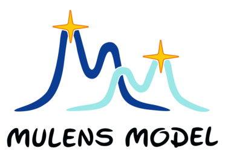

# MulensModel

<dl>MulensModel is package for modeling microlensing (or &mu;-lensing) events. </dl>

## Roman Microlensing Data Challenge 2026 (RMDC26)

[RMDC26](https://rges-pit.org/data-challenge/) was announced in Jan 2026. If you want to participate, then you're welcome to use MulensModel. It's possible some new features will be needed. In that case, please [open an issue](https://github.com/rpoleski/MulensModel/issues/new) and we will try to help.

## Documentation

<!--  -->

[**Detailed documentation: https://rpoleski.github.io/MulensModel/**](https://rpoleski.github.io/MulensModel/)

[Latest release: 3.8.0](https://github.com/rpoleski/MulensModel/releases/latest) and we're working on further developing the code.

MulensModel can generate a microlensing light curve for a given set of microlensing parameters, fit that light curve to some data, and return a chi2 value. That chi2 (and its gradient in some cases) can then be input into an arbitrary likelihood function to find the best-fit parameters.

If you want to learn more about microlensing, please visit [Microlensing Source website](http://microlensing-source.org/) and [Microlensing Mini Course](https://rges-pit.org/outreach_mini_landing/).

Currently, MulensModel supports:
* Lens Systems: point lens or binary lens. Shear and convergence allowed for both point and binary lenses.
* Source Stars: single source, binary source, or even larger number of sources.
* Effects: finite source (1-parameter), parallax (satellite & annual), binary lens orbital motion (2-parameter or **keplerian [both circular and elliptical] - new**), xallarap effect (with one or two luminous sources), different parametrizations of microlensing models.

Need more? Open [an issue](https://github.com/rpoleski/MulensModel/issues), start [a discussion](https://github.com/rpoleski/MulensModel/discussions), or send us an e-mail. 



## Acknowledgements

Are you using MulensModel for scientific research? Please give us credit by citing the [paper published in "Astronomy and Computing"](https://ui.adsabs.harvard.edu/abs/2019A%26C....26...35P/abstract) and [ASCL reference](http://ascl.net/1803.006). For arXiv version please see [link](https://arxiv.org/abs/1803.01003). You should also cite relevant papers for algorithms used. In a typical run that uses binary lenses these will be [Bozza (2010)](https://ui.adsabs.harvard.edu/abs/2010MNRAS.408.2188B/abstract) and [Skowron & Gould (2012)](https://ui.adsabs.harvard.edu/abs/2012arXiv1203.1034S/abstract). [HERE](documents/papers_to_cite.md) is a list of papers to cite for various algorithms used in MulensModel. We also thank other people who helped in MulensModel development - please see list in [AUTHORS.md file](AUTHORS.md).


## Examples and tutorials

We have more than a dozen of examples - starting from very simple ones (like plotting a model) to very advanced (like fitting a binary lens model with finite source effect). Please see:
* [**a list of examples and tutorials**](documents/examples_list.md),
* [**description of all microlensing parameters used in MulensModel**](documents/parameter_names.pdf),
* [**methods used to calculate magnification in MulensModel**](documents/magnification_methods.pdf), and
* [**high-level fitting example**](examples/example_16).

The full documentation of API is at [https://rpoleski.github.io/MulensModel/](https://rpoleski.github.io/MulensModel/).

## How to install?

The easiest way is to run:
```
pip install mulensmodel
```
which will download all files and also install all dependencies (using the [PyPI website](https://pypi.org/project/MulensModel/)).

If the above method doesn't work or you would like to see other possibilities, then please see [the install file](documents/install.md).

## Contributing

If you want to contribute to MulensModel, then please see [this file](CONTRIBUTING.md).

---
[](http://www.astropy.org/) 
[](https://pypi.python.org/pypi/mulensmodel/) 
[](https://GitHub.com/rpoleski/MulensModel/stargazers/) 
[](https://lbesson.mit-license.org/) 
[](https://ui.adsabs.harvard.edu/abs/2019A%26C....26...35P/abstract)
[](https://arxiv.org/abs/1803.01003)
[](https://emac.gsfc.nasa.gov?cid=2207-125)


file revised Jan 2026
